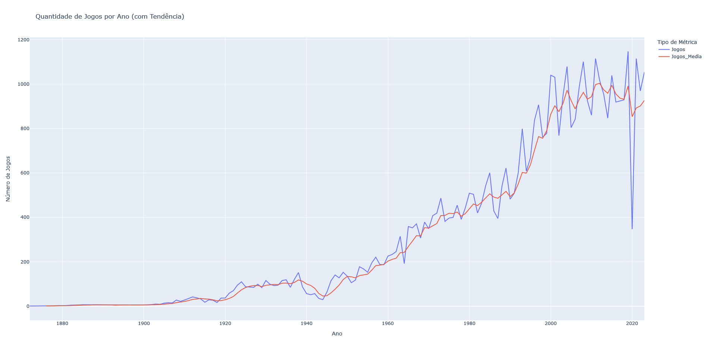
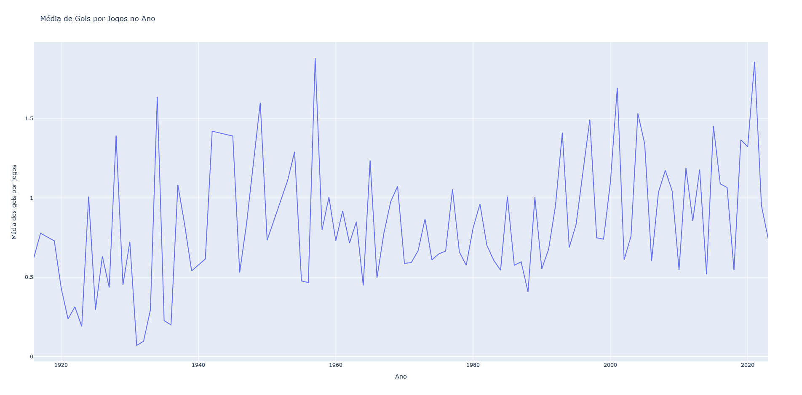
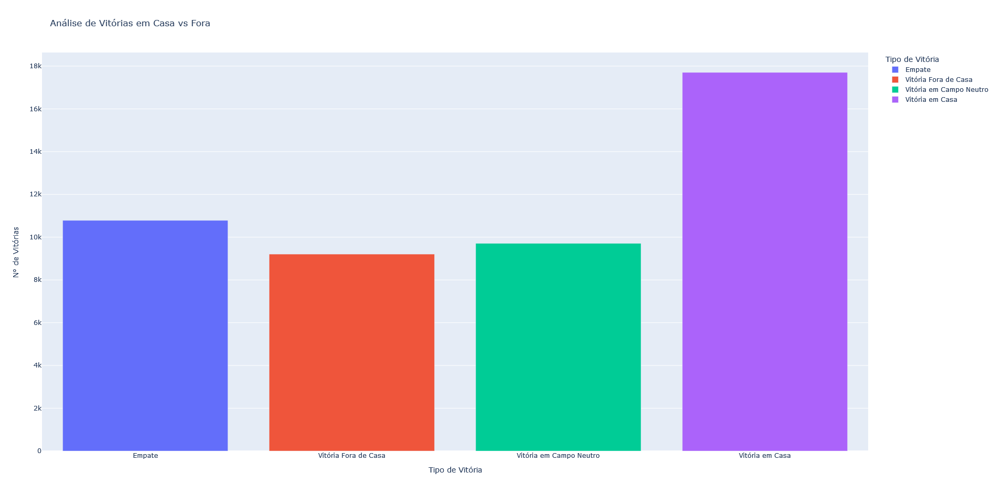
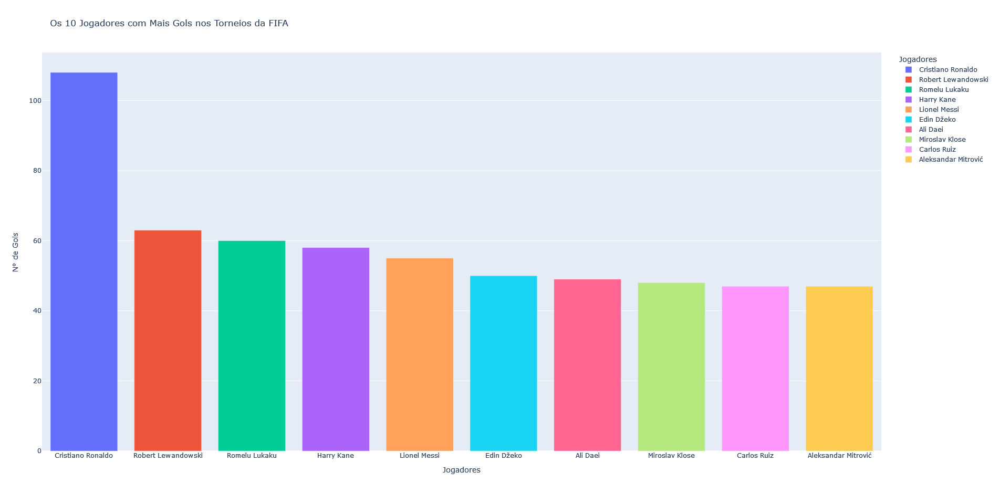
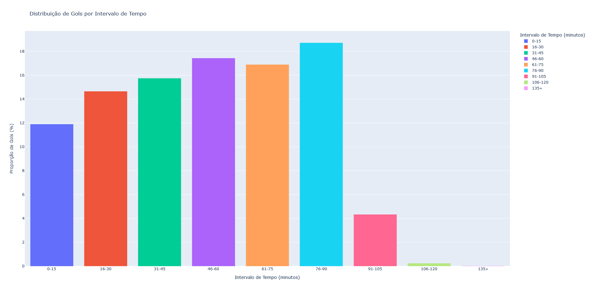
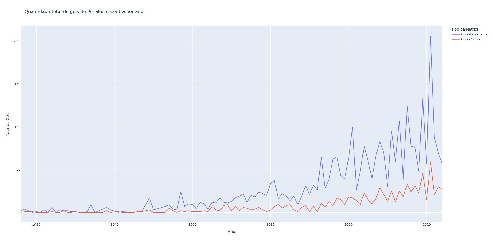

# Análise de Resultados do Futebol Global (1872-2024)

Este repositório contém análises exploratórias e insights sobre o dataset histórico de partidas de futebol internacional, abrangendo jogos entre seleções nacionais de 1872 até 2024. O objetivo deste projeto é aplicar técnicas de análise de dados com Pandas, Plotly e outras ferramentas para extrair informações relevantes sobre a evolução do futebol ao longo do tempo.

## Estrutura do Projeto

### 1. Tendências Históricas de Partidas
- **Evolução de Partidas ao Longo do Tempo:** Análise do número de jogos disputados por ano, observando o crescimento ao longo dos anos.

- **Comparação de Gols ao Longo do Tempo:** Investigação da média de gols por jogo ao longo dos anos, comparando o futebol moderno com épocas passadas.

### 2. Análise de Desempenho de Times
- **Análise de Vitórias em Casa vs Fora:** Comparação da performance das equipes jogando em casa, fora e em locais neutros.

- **Desempenho em Torneios vs Amistosos:** Comparação da performance das equipes em torneios como a Copa do Mundo versus jogos amistosos.

### 3. Análise de Gols
- **Jogadores Mais Prolíficos:** Identificação dos jogadores que mais marcaram gols ao longo do tempo.

- **Distribuição de Gols por Minuto:** Análise dos minutos em que as equipes tendem a marcar mais gols.

- **Análise de Pênaltis e Gols Contra:** Frequência de pênaltis e gols contra ao longo dos anos.

### Próximos Passos:
Ainda faltam as análises dos seguintes itens:
- **4. Análise de Pênaltis:** Foco em decisões por pênaltis e desempenho das seleções em cobranças.
- **5. Análise Geográfica:** Investigação da distribuição das partidas por localidade e impacto do local neutro.
- **6. Insights de Títulos e Torneios:** Estudo dos times mais vitoriosos por torneio e padrões de desempenho em diferentes competições.

## Ferramentas Utilizadas
- **Python**
  - Pandas para manipulação e análise de dados
  - Plotly para visualizações interativas
- **Visual Studio Code** para desenvolvimento e documentação
- **GitHub** para controle de versão e compartilhamento do projeto

## Como Contribuir
Este repositório será atualizado regularmente com novas análises e insights. Sinta-se à vontade para acompanhar o progresso, sugerir melhorias e contribuir com feedbacks.

Link do dataset original: [Kaggle - Global Football Results Dataset](https://www.kaggle.com/martj42/international-football-results-from-1872-to-2017)

---